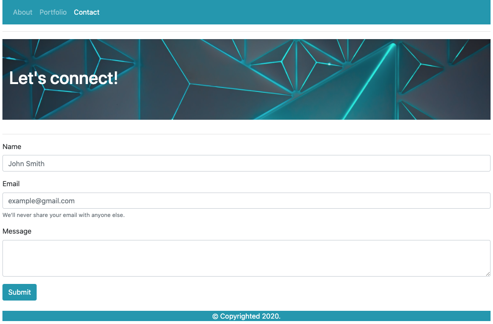

# Assignment: 02 Responsive Portfolio Using Bootstrap
I created a simple portfolio site with index, portfolio and contact pages. 

# Screenshots of Project

# Some examples of the HTML Edits I made were
I experimented with responsive elements, Boostrap grid system and cards as well as a simple form.